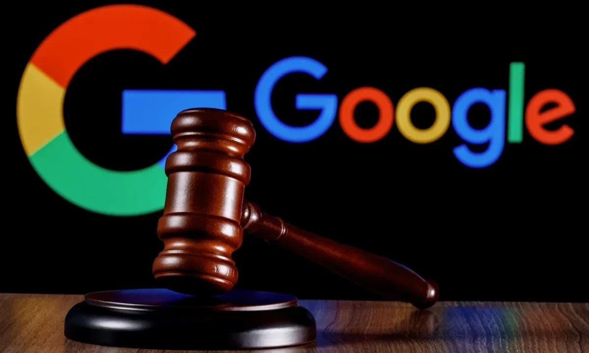
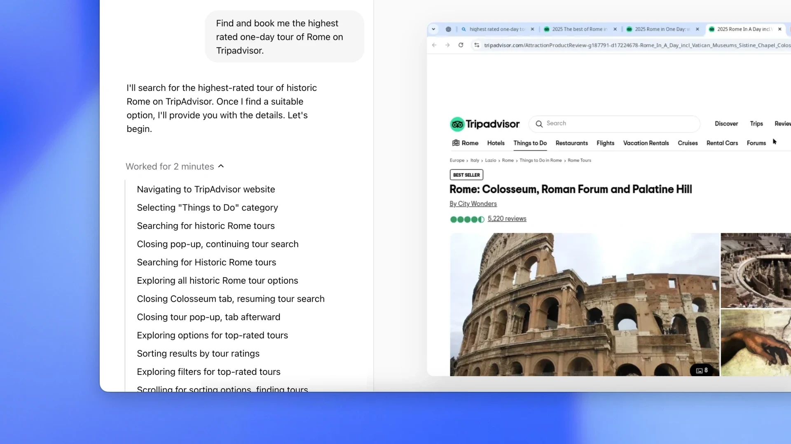
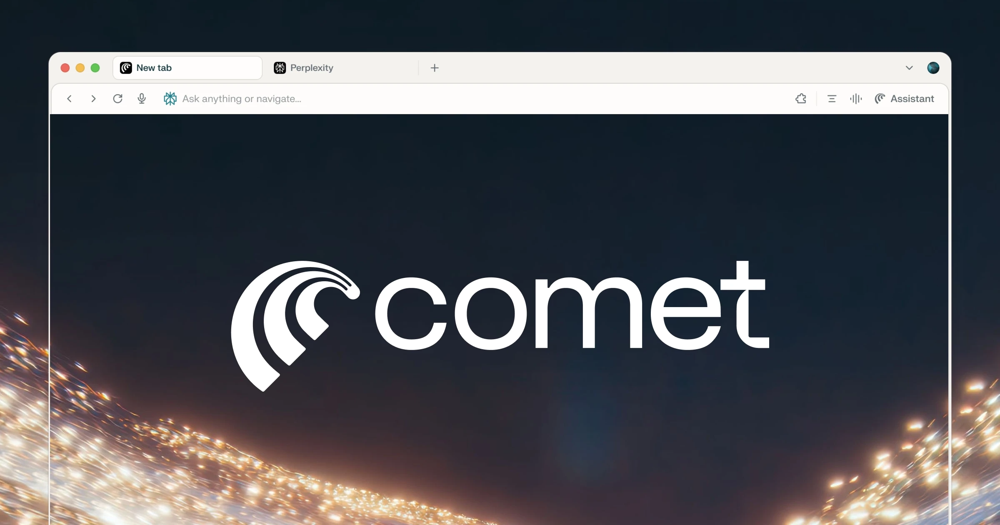
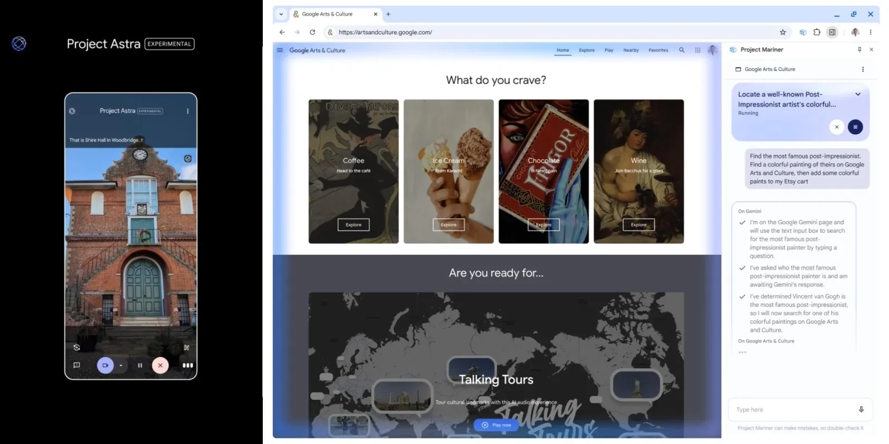

# ChatGPT浏览器、Perplexity Comet和Google Mariner：搜索的未来是智能体

---

2025年7月9日，搜索的游戏规则变了。

Perplexity发布了Comet浏览器，路透社爆料OpenAI几周内就会推出ChatGPT浏览器。这不是简单的产品竞争——这是互联网交互方式的转折点。

为什么这些公司突然都要做浏览器？因为他们想摆脱Google的控制，建立能替用户思考、行动、执行任务的平台。更重要的是，他们想要用户的搜索数据。时机也恰到好处：Google正面临史无前例的反垄断压力，根本没法全力防守自己的浏览器生态。

---

## Google的反垄断困境：完美的进攻时机

智能体浏览器的竞赛，赶上了一个绝佳的窗口期。Google现在被法律压得喘不过气：

- **2024年8月5日**：联邦法官裁定Google在搜索市场非法垄断
- **2025年4月17日**：第二次裁定发现Google在数字广告技术市场违反反垄断法
- **进行中**：司法部要求Google在2025年8月前剥离Chrome浏览器

这给竞争对手创造了前所未有的机会。**Google不能强硬防守浏览器生态，否则会引发更多反垄断问题。**这家曾经每年付给苹果200多亿美元保持默认搜索引擎地位的公司，现在可能被限制这些交易——而这些交易正是它护城河的基础。（苹果已经在积极寻找AI合作伙伴，因为和Google的合作关系出现裂痕）

## 为什么ChatGPT和Perplexity要做自己的浏览器？

ChatGPT已经有Chrome扩展，可以把它设为默认搜索引擎。社区也开发了一些增强体验的插件。但出于商业和技术原因，平台控制权有战略意义。

### 1. 数据收集和用户上下文

除了市场份额，Google的竞争壁垒不只是搜索算法，而是来自Gmail、Drive、商家评价、日历，最重要的是用户搜索历史的全面用户上下文。

如果你看过Google I/O 2025，就知道这些数据源是Google个人上下文的基石——Google说今年夏天会推出，现在已经可以选择加入。个人上下文就是字面意思——个性化搜索结果——无论是通过Google AIO、Gemini、AI模式，还是他们最终给Mariner起的名字。

ChatGPT最近发布了记忆功能——有人认为这会让它成为史上最具粘性的产品——但AI对话的上下文和Google拥有的海量用户数据相比，**根本不是一个量级**。这是ChatGPT和Perplexity做自己浏览器的原因之一：收集更多用户数据。正如Perplexity CEO Aravind Srinivas在TBPN播客中所说：

> "这也是我们想做浏览器的另一个原因，我们想获取应用之外的数据，更好地了解你。"

👉 [想了解AI搜索如何真正理解用户意图？看看这个工具如何做到的](https://pplx.ai/ixkwood69619635)

### 2. 智能体能力需要平台控制

浏览器扩展根本实现不了这些公司设想的深度智能体功能。**自主任务执行需要系统级访问权限**——身份验证流程、支付处理、跨站点交互、标签页管理。当AI智能体需要跨多个网站订机票、管理跨平台身份验证、完成支付流程时，它需要控制整个浏览环境。

### 3. 逃离Google的数据和体验控制

尽管这些浏览器使用Chromium作为基础，但它们控制着关键的用户体验层。它们可以设置不同的默认搜索引擎，实现原生广告拦截器，直接在浏览界面嵌入AI助手。**平台控制比底层引擎更重要**——就像Android的价值来自Google的服务层，而不是底层的Linux内核。

重要的是，Google不能"釜底抽薪"，阻止竞争对手使用Chromium。这个开源项目采用宽松的BSD风格许可，允许任何人使用、修改和分发代码。微软（Edge）、Opera、Vivaldi和Brave都在Chromium上构建了成功的浏览器，这些许可不能追溯更改。虽然Google员工完成了Chromium的大部分开发，但项目的开放性意味着竞争对手可以自由分叉和独立开发。而且，如果Chrome被剥离，这种可能性会更小。

---

## 技术能力：智能体浏览器能做什么？

### OpenAI的Operator和ChatGPT浏览器功能

**计算机使用智能体（CUA）模型**：OpenAI的CUA，也就是ChatGPT Operator，结合了GPT-4o的视觉能力和强化学习，通过截图和鼠标/键盘操作与图形界面交互，不需要自定义API集成。

**云端执行**：Operator在远程服务器上运行，而不是本地，可以同时处理多个任务，集中进行安全控制。

**性能基准**：CUA在OSWorld任务自动化上达到38.1%的成功率（Anthropic是22.0%，人类是72.4%）。Google的Mariner在WebVoyager浏览器任务上得分83.5%。这些测试衡量的是真实世界的任务完成——预订、填表——而不是搜索质量。

**当前局限**：Operator在登录、支付和验证码时需要人工接管。测试显示它有幻觉问题，日期错误和预订错误，限制了关键任务的可靠性。

### Perplexity Comet的智能体浏览器功能

**深度集成**：Comet通过主页输入、地址栏和侧边栏嵌入AI，允许从任何上下文开始对话。AI可以看到并解释当前标签页内容，进行网页摘要和上下文理解。

**自主任务管理**：Comet自主管理标签页，访问浏览器历史。在获得权限后，它可以操作Gmail和Google日历，从辅助转向主动任务执行。

**社交媒体集成**：当登录X等平台时，用户可以提示Comet通过无头浏览模式发布回复，展示了与网络应用的机器速度交互。

**隐私权衡**：完整功能需要广泛的Google账户权限——屏幕查看、发送邮件、访问联系人和日历管理。这实现了强大的自动化，但需要大量数据访问。

### Google Mariner智能体功能

**技术能力**：Project Mariner使用Gemini 2.0截取屏幕截图，在云端处理，然后将导航命令发送回Chrome。在基于云的虚拟机上运行，可以同时处理最多10个任务，不会阻塞用户。

Mariner在WebVoyager浏览器自动化基准测试中达到**83.5%**的成功率。但它目前无法完成购买、接受cookie或同意服务条款，敏感操作需要人工监督。

**集成策略**：Google通过"智能体模式"将Mariner功能集成到Gemini应用和Google搜索的AI模式中，增强现有产品而不是创建新平台。

### 浏览器自动化协议和架构

**当前实现方法**：智能体浏览器使用专有自动化系统，而不是标准化协议。OpenAI的Operator使用截图分析和云端控制，而Perplexity Comet直接与浏览器API和DOM操作集成。

对于前台操作，系统使用计算机视觉和直接界面控制。后台自动化仍然有限，大多数当前解决方案需要用户监督复杂工作流程。

**身份验证和跨平台挑战**：实现面临跨会话的身份验证障碍和网站兼容性问题，因为许多网站会阻止自动化交互。速度瓶颈仍然很明显，智能体需要几秒钟来分析和行动。

---

## 智能体浏览器对比：关键差异

**核心要点**：虽然三者都利用AI进行网络自动化，但它们代表了根本不同的战略方法——OpenAI专注于平台控制，Perplexity瞄准搜索市场颠覆，Google增强其现有生态系统主导地位。

---

## 结语：在智能体搜索中保持可见

ChatGPT浏览器、Perplexity Comet和增强的Google能力的出现，标志着我们对网络交互思考方式的根本转变。看起来我们不是走向某一家公司"获胜"，而是走向一个碎片化的智能体搜索格局。

随着AI智能体代表用户执行任务的自主性增强，传统的"搜索"概念完全消解了。用户不会搜索航班——智能体会预订。用户不会研究产品——智能体会比较和购买。**浏览器变成了执行环境，而不是信息发现工具。**

当搜索转向AI智能体时，品牌必须针对智能体发现进行优化，而不是传统SEO。这意味着要理解AI系统和你想触达的用户的个人上下文。👉 [了解如何让你的内容在AI搜索时代保持竞争力](https://pplx.ai/ixkwood69619635)
